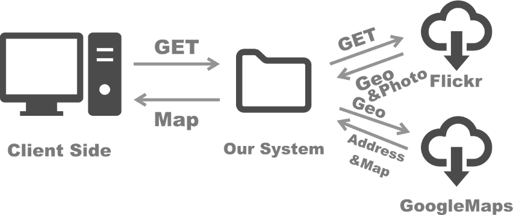

# ImageMappingTool

This is a practice to create a mashup application by using two external APIs.

## Structure

## Usage

The system has a user interface. A user can access from this Public IP address ~~54.252.25.48~~

As the screen shot above shows, a user can simply enter any keyword in the input field. For instance, if a user types “Tree” as parameter, GET method will fetch published images of which the tile is saved as “Tree” on Flickr. Then, Google Maps will place pins of the image of “Tree”. If users want to specify the location, they can simply type “Tree UK” just like you search on google. The user can click on the pin and a bubble speech will display the image. At the same time, the translated address will be showed in the text area below. A user is able to know where the photo was taken.
